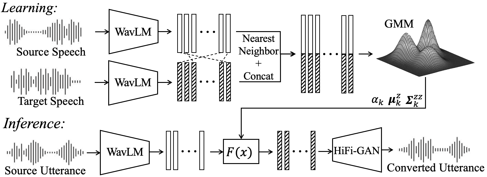
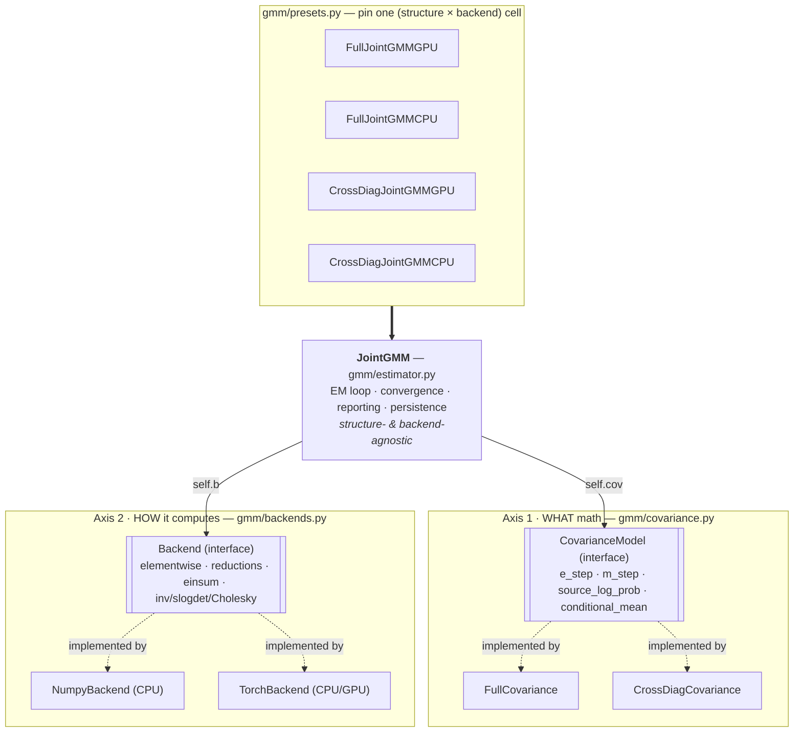
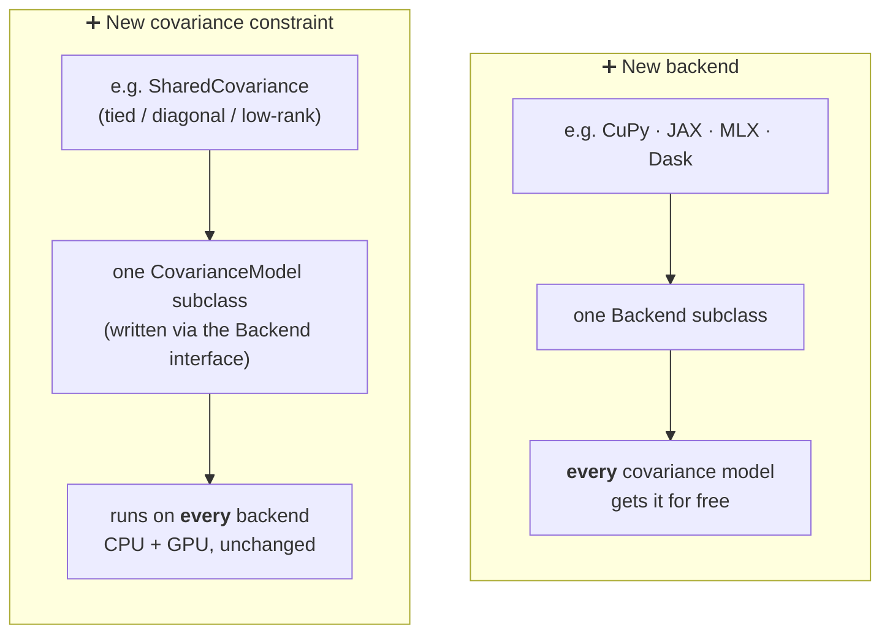

# SSL-GMMVC: Interpretable Voice Conversion via Locally Linear GMM Transforms in Self-Supervised Representation Space
Accepted at Interspeech2026

[](http://arxiv.org/abs/2606.10317)

## GMMs are back!

This repo contains code for **SSL-GMMVC**, our proposed voice conversion method from "SSL-GMMVC: Interpretable Voice Conversion via Locally Linear GMM Transforms in Self-Supervised Representation Space."



GMM mapping was the workhorse of voice conversion in the 2000s, before deep models took over.
**SSL-GMMVC** revives it in the representation space of a
self-supervised speech model: a lightweight, interpretable converter
(the conversion is just a locally linear transform)
on top of modern features. Old idea, new space.


## Setup

This project uses [uv](https://docs.astral.sh/uv/) for dependency management.

1. [Install uv](https://docs.astral.sh/uv/getting-started/installation/) (if you don't have it)

2. Clone the repo and sync the environment:

   ```
   git clone git@github.com:tomoya-san/ssl-gmmvc.git
   cd ssl-gmmvc
   uv sync
   ```

`uv sync` creates a virtual environment in `.venv/` and installs all dependencies.

> **Note:** The project pins CPython 3.10.18 (see `.python-version`). If that
> interpreter isn't already installed, `uv sync` will automatically download a
> standalone CPython 3.10.18 build into uv's managed cache and use it. You don't
> need to install Python yourself.

> **⚠️ GPU:** `torch`/`torchaudio` are pinned to **2.8.0+cu128** (CUDA 12.8) for
> the dev machine (RTX A6000, driver 570.x); a CUDA-capable GPU is required.
> `torchaudio` is also held `<2.9` because kNN-VC imports `torchaudio.sox_effects`,
> removed in 2.9. For a different CUDA/driver, adjust the torch index in
> `pyproject.toml` and re-sync.

## Demo

WIP

## Code Design

<details>

<summary>Click to expand</summary>

### Interface Design

The joint GMM is factored along two **independent** axes: *what* math
(covariance structure) and *how* it computes (array backend). This is joined by a single
EM driver that depends on neither. The presets just pin one cell of the grid.



### Benefits
Extending is a single, local change!



</details>

## Acknowledgements
Parts of code for this project are adapted from [kNN-VC](https://github.com/bshall/knn-vc) and [LinearVC](https://github.com/kamperh/linearvc).

Many thanks to the authors for releasing their work.